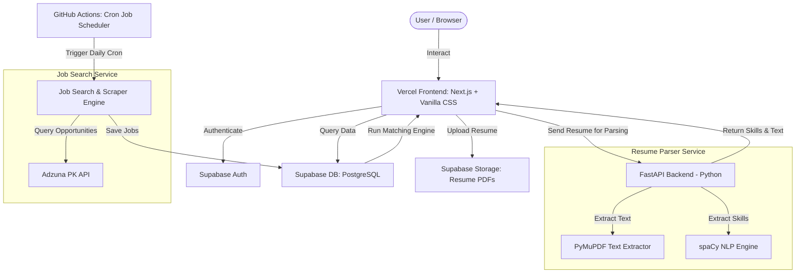

# System Architecture

The Resume-to-Opportunities Engine is built using a decoupled, service-oriented architecture designed to fit entirely within the free tiers of Vercel, Supabase, and Github.

## System Architecture Diagram

## Component Breakdown

### 1. Frontend & Web Portal (`frontend/`)
* **Technology**: Next.js (App Router, TypeScript, Vanilla CSS).
* **Role**: Provides the user interface for resume upload, skill management, job listings, and dashboard matching.
* **Hosting**: Vercel (Hobby Tier - $0/month).
* **Communication**: Communicates with Supabase using the Supabase JS SDK, and calls the Python Resume Parser via Serverless API routes (which proxy requests to the FastAPI instance).

### 2. Resume Parser Service (`services/resume-parser/`)
* **Technology**: Python, FastAPI, PyMuPDF, spaCy.
* **Role**: Accepts a PDF file upload, extracts raw text, filters sections, runs spaCy NLP models for entity and keyphrase extraction, matches entities against the skill dictionary, and returns structured profile information.
* **Hosting**: Render or Koyeb Free Tier (spins down after inactivity, but $0/month), or run locally for development.
* **Alternative**: Can also be executed as a local script or integrated as a TypeScript parser if external python hosting is unstable.

### 3. Job Search & Aggregator Engine (`services/job-search/`)
* **Technology**: Node.js/TypeScript (or Python script).
* **Role**: Periodic service that runs daily to query the Adzuna API for Pakistan (`country=pk`) and scrape additional selected local sites. It maps listings to a unified schema, performs deduplication, and inserts them into the Supabase database.
* **Hosting**: GitHub Actions (using workflow schedules, $0/month).

### 4. Database & Auth (`database/`)
* **Technology**: Supabase (PostgreSQL).
* **Role**: 
  * **Auth**: Manages user signup, login, session tokens, and passwords.
  * **Database**: Stores users, resumes, extracted skills, normalized jobs, user bookmarks, search history, and notifications.
  * **Storage**: A private bucket for original PDF resumes.
  * **RLS**: Row-Level Security ensures users can only read/write their own records.

### 5. Notification Service (`notifications/`)
* **Technology**: Node.js, Telegram Bot API, Resend Email API.
* **Role**: Triggered after the daily job search engine runs. It finds matching jobs for each user, compiles matches scoring above 70%, and sends a daily digest via Resend (email) or Telegram.

## Data Flow Diagrams

### Resume Processing Flow
1. User uploads a PDF in the Next.js frontend.
2. Next.js saves the PDF to a private Supabase Storage bucket.
3. Next.js calls the `resume-parser` API (FastAPI) passing the file content.
4. FastAPI extracts text using PyMuPDF and parses sections.
5. FastAPI extracts skills using spaCy + curated dictionary.
6. FastAPI returns the extracted skills, experience, and text to Next.js.
7. Next.js updates the user's profile and saves skills to `extracted_skills` table.

### Job Aggregation & Matching Flow
1. GitHub Actions triggers `job-search` script at 02:00 UTC daily.
2. The script calls Adzuna PK API and local scrapers.
3. Script deduplicates and inserts new jobs into Supabase `jobs` table.
4. Script triggers the matching engine logic (evaluating user skills and location preferences against the new jobs).
5. Matches scoring above 70% are inserted into the `notifications` table.
6. The `notifications` service reads pending alerts, compiles emails/Telegram messages, and sends them via Resend or Telegram Bot.
