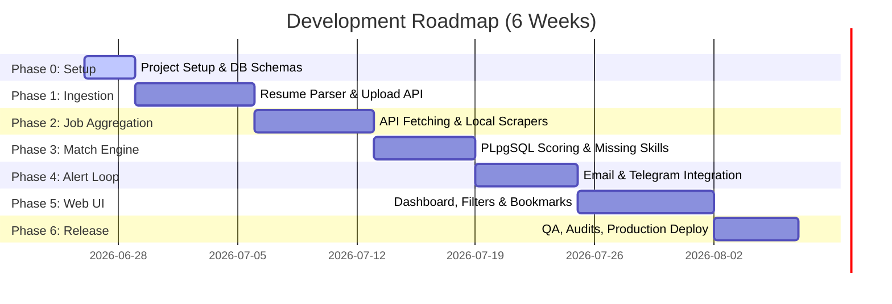

# Project Roadmap

The project is divided into distinct, manageable phases designed to take the app from setup to production within a structured timeline.

---

## Roadmap Timeline

---

## Phase Breakdowns

### Phase 0: Project Setup & Infrastructure
* **Objective**: Prepare repository layout, launch Supabase database, write initial documentation, and setup development guidelines.
* **Deliverables**: Database tables created, config files configured, git structure verified.

### Phase 1: Resume Upload & Parsing Service
* **Objective**: Build the PDF parsing parser microservice and the upload routing API.
* **Deliverables**: FastAPI parser running locally, Next.js API uploading files to Supabase Storage and passing payloads to the parser.

### Phase 2: Job Search Integration (Pakistan-Targeted)
* **Objective**: Setup daily job crawler querying Adzuna (Pakistan API) and local boards.
* **Deliverables**: Scraper module running inside `services/job-search`, saving normalized rows into database.

### Phase 3: Matching & Recommendations
* **Objective**: Build the scoring engine that links candidate profile skills to job postings.
* **Deliverables**: SQL Stored Procedure (`get_job_recommendations`) running inside PostgreSQL, UI showing match percentage details.

### Phase 4: Telegram & Email Notifications
* **Objective**: Complete user communication loop.
* **Deliverables**: Telegram bot responder verified, Resend email digest integrations complete.

### Phase 5: Dashboard & User Interface
* **Objective**: Construct a premium, highly responsive user dashboard using Vanilla CSS.
* **Deliverables**: Login pages, onboarding screens, job grids, search/filters, bookmarked lists, and settings options.

### Phase 6: Refinement, Testing & Launch
* **Objective**: Perform end-to-end user acceptance testing, resolve layout issues, and host in production.
* **Deliverables**: Frontend on Vercel, Parser on Koyeb, Scheduler on GitHub Actions. Target cost: $0.
