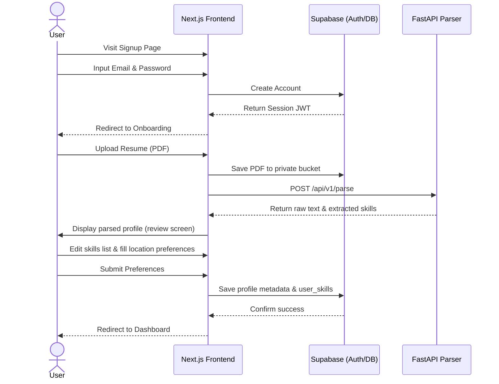
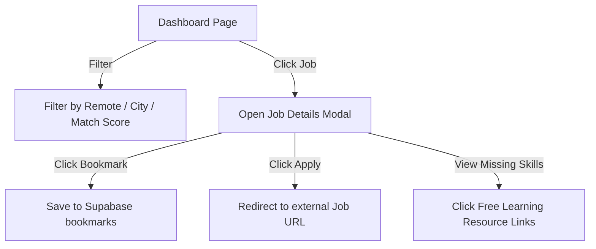

# User Flows

This document details the step-by-step user interactions and system transitions.

---

## 1. Onboarding & Profile Setup Flow

This flow guides a new user from register to their first job recommendations.

### Steps:
1. **Sign Up**: The user registers with email/password.
2. **Resume Prompt**: The user is welcomed and asked to upload their PDF resume.
3. **Parsing State**: While the file uploads and parses, a modern skeleton loading animation is shown.
4. **Validation/Edit**: The user reviews a list of tags representing their parsed skills. They can click "x" to remove a skill or search and add new skills.
5. **Preference Setting**: The user selects:
   * Target cities: Karachi, Lahore, Islamabad, Rawalpindi, Remote, etc.
   * Onsite / Remote / Hybrid.
   * Experience Level (Intern, Entry-level, Mid).
6. **Dashboard Launch**: The dashboard loads recommendations.

---

## 2. Dashboard Interaction & Job Discovery Flow

The primary interactive area for daily job searches.

### Steps:
1. **View Matches**: The user views a grid of job cards sorted by compatibility score.
2. **Filters**: The user toggles "Remote Only" or inputs locations like "Karachi" to filter down lists.
3. **Examine Match**: The user clicks a job card. A modal slides open showing:
   * Complete description.
   * Compatibility score gauge.
   * Match breakdown: "We matched your React and SQL skills, but you are missing Docker."
   * **Free Learning Links**: Under the missing skill "Docker", links to freeCodeCamp's Docker tutorial are displayed.
4. **Action**: The user bookmarks the job (changing card status to bookmarked) or clicks "Apply" which opens the job site (e.g. Rozee/Adzuna) in a new tab.

---

## 3. Telegram & Email Notification Setup Flow

How users configure and verify automated matching updates.

### A. Email Setup (Automatic)
* Users are opted-in by default to receive emails at their sign-up address.
* Users can visit the Settings panel, toggle "Email Digests" off/on, and click save.

### B. Telegram Bot Setup
1. User navigates to the **Settings** tab.
2. User toggles **Telegram Notifications** on.
3. The UI displays instructions:
   * "1. Open Telegram and search for `@PakJobMatchBot` (or click this link)."
   * "2. Send the message `/start <YOUR_UNIQUE_SECRET_TOKEN>` to the bot."
4. User clicks link, opens Telegram, and sends the command.
5. The Telegram Bot receives the request, parses `<YOUR_UNIQUE_SECRET_TOKEN>`, verifies it, retrieves the user ID, updates the `profiles.telegram_chat_id` in Supabase, and replies: "Successfully linked! You will now receive daily job matches."
6. Next.js dashboard updates settings status to **Telegram Connected**.
